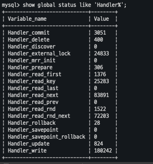

# 아키텍처

MySQL은 머리부분인 MySQL엔진과 손발 역할을 하는 스토리 엔진으로 구분된다.  
스토리 엔진은 핸들러 API를 만족하면 누구든지 스토리 엔진을 구현할 수 있다.  
MySQL서버에서 기본으로 제공되는 InnoDB 스토리 엔진과 MyISAM 스토리 엔진을 살펴볼 것이다.

## MySQL 엔진 아키텍처

커넥션 처리, SQL 파서, 옵티마이저, 캐시 & 버퍼 등을 관리하는 역할

## 스토리 엔진

SQL 문장을 분석해서 요청을 처리하도록 하는 역할, 디스크에 데이터를 저장하거나 읽어오는 작업을 한다.
MySQL서버에서 MySQL 엔진은 하나지만 스토리 엔진은 여러개 가질 수 있다. (MySQL 서버는 MySQL 엔진 + 스토리 엔진)  
스토리 엔진은 성능 향상을 위해 키 캐시(MyISAM 스토리엔진), InnoDB 버퍼풀(InnoDB 스토리 엔진) 을 내장하고 있다.

### 핸들러 API

MySQL 엔진이 쿼리 실행을 위해 핸들러 API를 사용하여 스토리 엔진에게 요청하는 것을 핸들러 요청이라고 한다.  
각 데이터베이스마다 핸들러 API를 통해 얼마나 많은 데이터 작업이 있었는지 `show global status like 'Handler%';` 명령으로 알 수 있다.  

## MySQL 스레딩 구조

MySQL은 프로세스 기반이 아닌 스레드 기반으로 작동하며, ForeGround스레드와 Backgraound 스레드로 구분할 수 있다. 그중에서 사용자 요청에 대한 처리를 하는 스레드는 'thread/sql/one_connection' 스레드이다.

## 메모리 할당 및 사용 구조

MySQL에서 사용되는 메모리는 크게 두가지이다.

1. 글로벌 메모리 영역: 모든 스레드가 공유하는 영역으로, 테이블 캐시, InnoDB버퍼풀, InnoDB 어댑티브 해시 인덱스, InnoDB 언두로그 가 있다.
2. 세션(커넥션) 메모리: 클라이언트 스레드가 쿼리를 처리하기 위해 사용하는 메모리영역으로, 스레드별로 독립된 공간으로 할당된다. 쿼리를 실행할 때만 할당되는 영역인 조인 버퍼, 소프트 버퍼와, 커넥션이 열러 있는 동안 유지되는 커넥션 버퍼와 결과 버퍼가 있다.
   대표적인 메모리 영역은 다음과 같다.
   - 정렬 버퍼
   - 조인 버퍼
   - 바이너리 로그 버퍼
   - 네트워크 버퍼

## 쿼리 캐시

## 스레드 풀

MySQL 엔터프라이즈 스레드 풀 기능은 MySQL 서버 프로그램에 내장되어 있지만 Percona Server의 스레드 풀은 플러그인 형태로 작동하게 되어 있다는 차이가 있다.
스레드 풀은 내부적으로 사용자의 요청을 처리하는 스레드의 개수를 줄여서 cpu가 제한된 스레드 처리에만 집중하도록 하여 서버의 자원 소모를 줄이는 것이 목적이다.

### 스레드 풀의 개수 조정

하지만 스레드 풀에 스레드를 무작정 많이 생성한다고 좋은가?
스레드 풀은 동시에 실행하는 스레드 수를 '줄여서' cpu자원을 효율적으로 사용하기 위함이라고 했다. 스레드를 많이 생성하면 스케줄링하는 과정에서 cpu가 스케줄링에만 자원을 소모하게 되면서 쿼리 작업 처리가 느려질 수도 있다.  
Percona Server 스레드 풀은 기본적으로 CPU 코어 개수만큼 스레드 그룹을 생성한다. 일반적으로 코에 개수와 맞추는 것이 CPU 프로세서 핀화도를 높이는 데 좋다.

### 스레드 풀에 있는 모든 스레드가 작업중이라면

## InnoDB 스토리 엔진 아키텍처

InnoDB 는 MySQL에서 사용할 수 있는 스토리 엔진 중 거의 유일하게 레코드 기반의 잠금을 제공하며, 그 때문에 높은 동시성 처리가 가능하고 안정적이며 성능이 뛰어나다.

## 프라이머리 키에 의한 클러스팅

InnoDB의 모든 테이블은 기본적으로 프라이머리 키를 기준으로 클러스터링되어 저장된다. -> 데이터 파일이 프라이머리 키 값을 기준으로 디스크에 저장된다. = range scan에 매우 효율적이다.

<!-- 모든 세컨터리 인덱스는 레코드의 주소 대신 프라이머리 키의 값을 논리적인 주소로 사용한다. -->

MyISAM 스토리 엔진에서는 클러스터링 키를 지원하지 않는다. 그래서 MyISAM 테이블에서는 프라이머리 키와 세컨더리 인덱스는 구조적으로 아무런 차이가 없다.  
MyISAM 테이블의 프라이머리 키를 포함한 모든 인덱스는 물리적인 레코드의 주소값을 가진다.

## MVCC(Mutil Version Concurrency Control)

> InnoDB스토리 엔진을ㄴ 트랜잭션이 Rollback 될 가능성에 대비해 변경되기 전 레코드를 언두 공간에 백업해주고 실제 레코드 값을 변경하는 방식을 MVCC라고 한다.

레코드 레벨의 트랜잭션을 지원하는 DBMS가 제공하는 기능으로, '잠금 없는 일관된 읽기'를 제공한다.  
InnoDB는 Undo log를 이용해 이 기능을 구현하였다. (세션 메모리에 해당, 스레드당 독립된 메모리 공간)  
Update 문장이 실행되면 커밋 여부와 관계없이 InnoDB버퍼 풀에 새로운 값이 반영 되고, 기존 값은 Undo log에 기록된다.(InnoDB 버퍼의 변경 내용은 InnoDB 스토리 엔진의 백그라운드 스레드에 의해 기록되므로, 변경된 내용이 디스크의 데이터 파일에 기록됐는지 여부는 시점에 따라 다름)  
위 상태에서 다른 트랜잭션이 레코드를 조회하면? Undo log에 기록된 기존값을 조회한다.(Read Uncommited는 버퍼풀을 조회)  
Read_Commited 나 그 이상 격리 수준은 Undo log 영역을 읽는다.  
여기서 트랜잭션이 길어지게되면 Undo log에도 기록이 계속 쌓이면서 시스템 테이블스페이스의 공간이 많이 늘어나는 상황이 발생할 수 있다.

### Undo log에 기록된 데이터 삭제 시점

커밋 후 바로 삭제되는 것이 아니라 언두 영역을 필요로 하는 트랜잭션이 더는 없을 때 삭제된다.

## 자동 데드락 감지

InnoDB 스토리엔진은 내부적으로 잠금이 교착 상태에 빠지지 않는지 체크하기 위해 잠금 대기 목록을 그래프 형태로 관리한다.  
데드락 감지 스레드가 주기적으로 그래프를 검사하면서 데드락에 빠진 트랜잭션이 있는지 확인하고, 있다면 그중 하나를 강제 종료한다.  
강제 종료하는 기준은 트랜잭션의 Undo log 양이며, Undo log 레코드를 적게 가진 트랜잭션인데, 롤백했을 때 Undo log가 적어야 MySQL 서버가 처리하는 작업이 적어서 서버 부하를 덜 유발하기 때문이다.  
`innodb_table_locks` 시스템 변수를 활성화하면 레코드 락 뿐만 아니라 테이블 레벨 락도 감지할 수 있다.

### 동시 요청이 많은 경우 데드락 감지

데드락 감지를 하기 위해 잠금 목록 검사를 하는데 이때, 잠금 상태가 변경되지 않도록 잠금목록 저장 리스트(잠금 테이블)에 락을 걸로 데드락을 찾는다.  
데드락 감지 스레드가 느려지면 쿼리 요청도 느려지게 되며, 결국 서비스에 악영향을 미치게 된다. 이렇게 동시 처리 스레드가 매우 많은 경우 데드락 감지 스레드가 많은 cpu 자원을 소모할 수 있고, 쿼리 처리하는 스레드는 cpu에 의한 처리가 뒤로 밀려나게 된다.  
이를 해결하기 위해 MySQL은 `innodb_deadlock_detect` 시스템 변수를 제공하며, 이를 OFF로 설정하면 데드락 감지 스레드는 더는 동작하지 않게 된다. 이렇게 되면 데드락 자동감지가 되지 않아 무한정 대기 상태에 빠질 수 있으므로 추가로 timeout을 설정하는 것이 좋다.  
`innodb_lock_wait_timeout` 시스템 변수를 활성화하여 일정 시간이 지나면 자동으로 요청을 실패하도록 설정할 수 있다. timeout은 기본적으로 50초보다 훨씬 낮은 시간으로 변경해서 사용하는 것을 권장한다.
