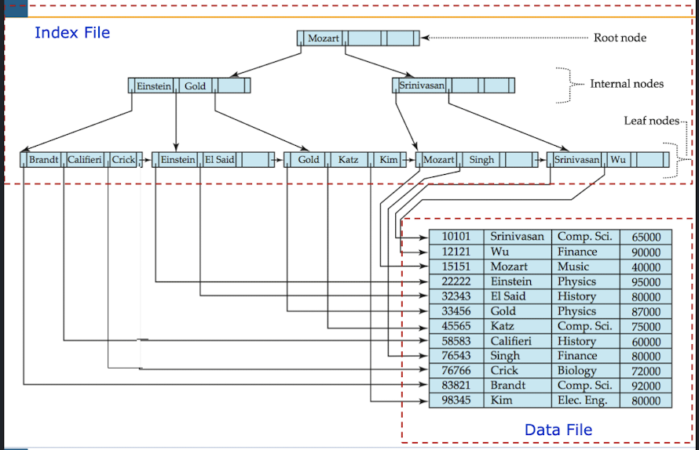
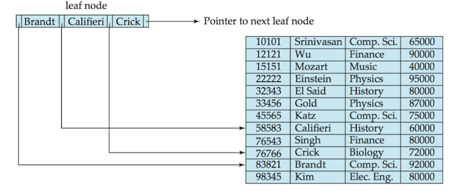

## 인덱스 타입

1. 정렬 인덱스: 조회하혀는 키가 정렬되어 있다.
2. 해시 인덱스: 조회하려는 키가 해시 함수를 사용해서 버킷 전체에 균일하게 분산된다.

## 정렬 해시

인덱스 파일이 정렬되고 인덱스 파일에는 레코트의 위치를 저장하고 있어서 인덱스 파일을 통해 레코드에 접근한다.

## 해싱 인덱스

## 키

1. 슈퍼키: 유일성 만족
2. 후보키: 유일성 최소성 만족
3. 대체키: 유실성 최소성 만족하지만 기본키로 선정되지 않은 키: 유일성가 최소성을 만족시키는 키로, 후보키에서 선택된 키

## 이진 트리와 B- 트리(B트리)

### 이진 트리

자식 노드가 2개인 트리

#### B트리

이진 트리를 확장해 하나의 부모 노드가 가질 수 있는 자식 노드의 최대 숫자가 2보다 큰 트리 구조이다.  
균형 잡힌 트리이므로 루트부터 모든 리프의 경로의 길이가 동일하다.  
노드에 키와 데이터를 가지고 있다.

### B(B-)트리와 B+ 트리(=B+-트리)

| 구분      | B-트리                           | B+트리                                             |
| --------- | -------------------------------- | -------------------------------------------------- |
| 내부 노드 | 키와 값(레코드 주소 또는 데이터) | 키만 저장 (값 없음)                                |
| 리프 노드 | 키와 값                          | 키와 값 (레코드 주소 또는 데이터)                  |
| 값의 위치 | 모든 노드에 존재 가능            | **리프 노드에만 존재**                             |
| 순차 탐색 | 어려움                           | **리프 노드끼리 연결되어 있어서 범위 탐색에 유리** |

#### B+트리



키에 의해서 각각 식별되는 레코드의 효율적인 삽입, 검색과 삭제를 통해 정렬된 데이터를 표현하기 위한 트리자료구조의 일종이다.  
B트리와 대조적으로 B+트리는, 모든 레코드(또는 레코드의 주소)들이 리프 노드에 정렬되어있다. internal 노드에 키(search key) 값만 저장된다.  
리프노드의 포인터가 인덱스로 적용된 속성값의 레코드를 가르킨다.  
데이터가 linked list로 연결되어 있어서 range검색에 유용하다.  


## 클러스터드 인덱스와 논클러스터드 인덱스

클러스터(Cluster)란 여러 개를 하나로 묶는다는 의미로 주로 사용되는데, 클러스터드 인덱스도 크게 다르지 않다. 인덱스에서 클러스터드는 비슷한 것들을 묶어서 저장하는 형태로 구현되는데, 이는 주로 비슷한 값들을 동시에 조회하는 경우가 많다는 점에서 착안된 것이다. 여기서 비슷한 값들은 물리적으로 인접한 장소에 저장 되어 있는 데이터들을 말한다.

클러스터드 인덱스(Clustered Index)는 인덱스가 적용된 속성 값에 의해 레코드의 물리적 저장 위치가 결정되는 인덱스이다.

- 클러스터드 인덱스는 B+ 트리 형태로 구성되어 있다.
- 데이터베이스에서 일반적으로 기본키를 클러스터드 인덱스로 생성한다.
- 인덱스 페이지가 실제 데이터 페이지를 가지고 있다.
- 인덱스가 적용된 속성 값(주로 Primary Key)에 의해 레코드의 저장 위치가 결정 되며 속성 값이 변경되면 그 레코드의 물리적인 저장 위치 또한 변경되어야 한다.
- 인덱스 파일만 참조해서 sql query가 가능하다.

논클러스터드 인덱스(Non-clustered Index)는 데이터를 물리적으로 정렬하지 않는다.

- 논클러스터드 인덱스는 별도의 인덱스 테이블을 만들어 실제 데이터 테이블의 행을 참조한다.
- 테이블 당 여러 개의 논클러스터드 인덱스를 생성할 수 있다.

## 효율적으로 인덱스 구성하는 방법

- Cardinality: 고유값의 개수
- Selectivity 선택도: 데이터 집합에서 특정 값을 얼마나 잘 골라낼 수 있는가에 대한 지표

```
selectivity - cardinality / total number of records
```

선택도가 1에 가까울 수록 칼럼값들이 유니크하다는 의미 = 인덱스 칼럼으로 최적이라는 의미
