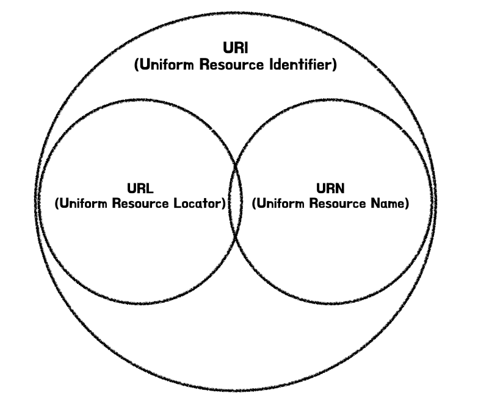

### URI, URL, URN의 차이점



1. URI는 Uniform Resource Identifier의 약자로, 인터넷에서 자원을 식별하기 위한 문자열이다. URI는 URL과 URN을 포함하는 상위 개념입니다. 즉, 특정 자원을 식별하기 위한 포괄적인 방법을 제공하며, 자원의 위치나 이름을 나타낼 수 있습니다.
2. URL(Uniform Resource Locator) 는 URI의 한 형태로, 인터넷 상에서 자원의 위치를 나타내는 방식입니다. 자원이 어디에 있는지를 설명하는데 사용되며, 자원에 접근하기 위한 프로토콜을 포함합니다.
3. URN(Uniform Resource Name)는 URI의 또 다른 형태로, 자원의 위치와 상관없이 자원의 이름을 식별하는 방식입니다. 자원의 위치가 변하더라도 동일한 식별자를 유지할 수 있게 합니다. 특정 스키마를 따르며, 자원에 대한 영구적인 식별자를 제공합니다.

통상적인 관계로 URI와 URL은 같은 의미로 사용되고 있다.

### URL의 스킴 문법

```
<scheme>://<user>:<password>@<host>:<port>/<path>;<parameter>?<query>#<fragment>
```
