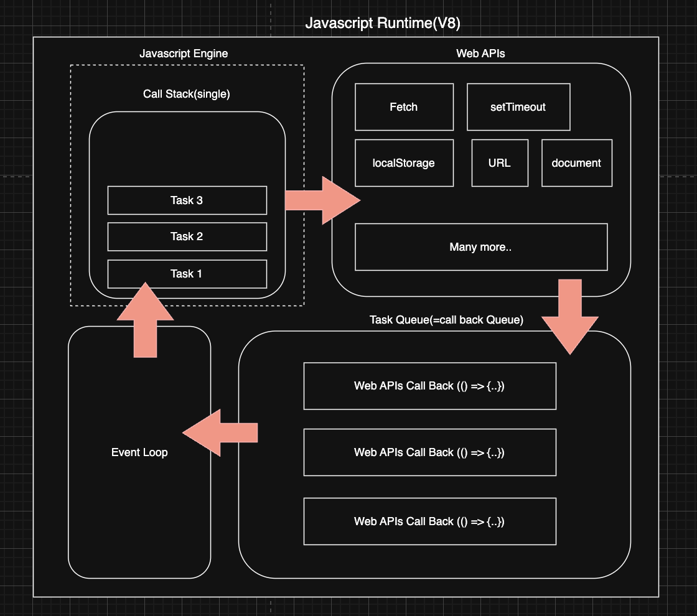

# Redis가 싱글 스레드로 만들어진 이유를 설명해주세요.

Redis는 인메모리로 데이터를 빠르게 접근하기 위해 사용하는 캐시 메모리입니다.

Redis가 단일 스레드(single-threaded)로 설계된 이유는 주로 성능 최적화, 복잡성 감소, 데이터 일관성 유지에 있다.
단일 스레드 모델은 멀티 스레드 모델에 비해 설계와 구현이 간단하다. 멀티스레드 환경에서는 동시성 문제(Race Condition, Deadlock)을 처리하기 위해 복잡한 동기화 매커니즘(뮤텍스, 세마포어)이 필요하지만, 단일 스레드 환경에서는 이런 문제를 자연스럽게 회피할 수 있다.

모든 명령어가 순차적으로 처리되기 때문에, 복잡한 락(lock) 매커니즘(공유락, 쓰기락 등) 없어도 데이터의 일관성을 자연스럽게 유지할 수 있다.  
Redis는 주로 메모리 내에서 빠르게 수행되는 I/O 작업을 처리하는 인메모리 데이터베이스로 설계되어, 매우 빠른 응답 시간을 제공한다. (하드디스크에 접근하는 것보다 RAM인 인메모리에 접근하는게 훨씬 빠르다)  
단일 스레드 *이벤트 루프(event loop)를 사용함으로써 *컨텍스트 스위칭(Context Switching)에 소요되는 오버헤드를 최소화할 수 있다.

Redis는 \*이벤트 기반(event-driven) 아키텍처를 채택하여 네트워크 요청을 효율적으로 처리합니다. 단일 스레드 이벤트 루프는 비동기적으로 여러 클라이언트의 요청을 처리할 수 있으며, 이를 통해 높은 동시성을 구현할 수 있다. 멀티스레드 모델에서는 이러한 비동기 처리의 이점을 충분히 활용하기 어려울 수 있다.

Redis 6.0 부터 클라이언트로부터 전송된 네트워크를 읽는 부분과 전송하는 I/O 부분은 멀티 스레드를 지원한다. 하지만 실행행하는 부분은 싱글 스레드로 동작하기 때문에 기존과 같이 Atomic을 보장한다.

# 더 자세히

## 단일 스레드가 성능 최적화와 연관이 있는 이유는?

### 멀티 스레드가 발생하는 문제점에 대해 생각해보자

1. context switching
   멀티 스레드가 많은 요청을 동시에 처리해서 더 빠를것 같지만, 멀티스레드면 context switching 이 발생하고, 비용과 자원을 사용한다.
   Context Switching 하는 과정에서 Page Fault가 발생하게 되면 더 오래 걸릴 것이다.

2. Race Condition
   멀티 스레드는 프로세스의 Code, Data 영역을 공유하면서 Critical Section(임계영역)에 대한 Race Condition이 발생한다.

**Critical Section**

> 여러 프로세스에게 공유되는 영역

**Thrasing**

> cpu가 프로그램 실행이 아닌 context switching, I/O 인터럽트로 인한 멈춤 현상이 자주 일어나면서 cpu 이용률이 낮아지는 현상을 말합니다.

# 추가 학습

## 멀티 스레드에서는 Single of Failure(SoF) 현상이 나타나는가?(with 멀티 프로세스)

그렇다. 스레드 하나에 오류가 생기면 전체 스레드가 종료될 수 있다는 점과 동기화 문제를 안고 있다.

멀티 프로세스는 하나가 죽어도 다른 프로세스와 완전히 격리되어 있어서 영향을 주지 않는다. 하지만 스레드보다 메모리 공간과 cpu 시간을 차지한다는 단점이 있다.

## 이벤트 루프(event loop)란? (wtih Javascript)

> Javascript의 런타임 모델의 구성 요소중 하나로, Stack에서 처리 중인 작업이 없다면 Task Queue에서 대기중인 작업을 Stack에 올려주는 역할을 한다.

[JS엔진에서 비동기는 어떻게 지원되는가?](https://mystudylog.tistory.com/104#%E2%9C%85%20JS%EC%97%94%EC%A7%84%EC%97%90%EC%84%9C%20%EB%B9%84%EB%8F%99%EA%B8%B0%EB%8A%94%20%EC%96%B4%EB%96%BB%EA%B2%8C%20%EC%A7%80%EC%9B%90%EB%90%98%EB%8A%94%EA%B2%83%EC%9D%B8%EA%B0%80%3F%20API%EB%A5%BC%20%ED%86%B5%ED%95%B4-1)  
Javascript 언어 자체는 싱글 스레드(Javascript의 메인 스레드인 이벤트 루프가 싱글 스레드)인지만 Javascript 런타임은 싱글 스레드가 아니다. 즉 Javascript 엔진을 구동하는 런타임 환경이 비동기 API를 지원하는 것이다.

Javascript 언어가 브라우저에 실행될 때 브라우저 엔진(크롬 기준)인 V8을 사용한다. 여기서 Javascript는 싱글 스레드 환경(= 싱글 스택)에서 동작하지만 비동기 처리를 위해 V8 엔진에서 제공하는 Web APIs, 호출 스택(Call Stack), 테스크 큐(Task Queue), \*이벤트 루프(Event Loop)와 같은 매커니즘을 활용한다.

아래 사진과 같이 구성되어 있다. (javascaript엔진에 힙도 있다. 단순화를 위해 Stack 만 표현)

### javascript V8엔진의 전체적인 흐름

1. fetch 같은 비동기 작업을 브라우저 Web API에게 맡기고(Wea API와 연결된 백그라운드 작업이 실행된다. 네트워크 작업, 렌더링 작업 등등)
2. 백그라운드 작업이 끝난 결과(Web API에서 비동기 처리가 완료가 된 결과)를 콜백 함수 형태로 큐에 넣는다.
3. Call Stack이 비어있다면 스택에 넣어 마무리 작업(Call Bakc 함수 실행)을 진행한다.

- 작업 대기실: Task Queue
- 작업을 옮겨주는 역할: Event Loop (큐에 있는 작업 -> stack으로 옮기기)
- 작업장: Stack + Heap(V8 엔진 메모리 기본 구성)

Web API에서 작업을 완료하면 Call Stack에 다른 작업을 하고 있을 수 도있으므로 바로 Call Stack으로 결과를 주는 것이 아니라 Task Queue에 넣어서 대기 상태로 만든다.  
Task Queue(=Call Back Queue)에는 Web APIs 의 작업이 완료된 후 반환되는 콜백 함수를 적재해 놓는다.  
**그리고 이벤트 루프가 Call Stack에 남아 있는 작업이 없음을 때 Task Queue에서 대기 중인 Call Back을 Call Stack에 올려준다.**
