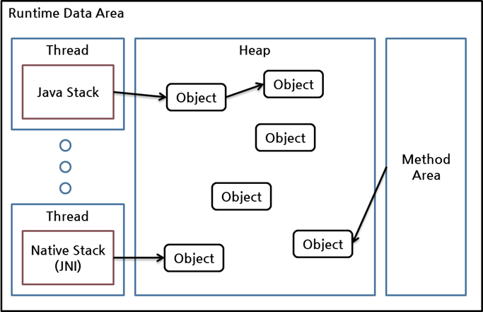
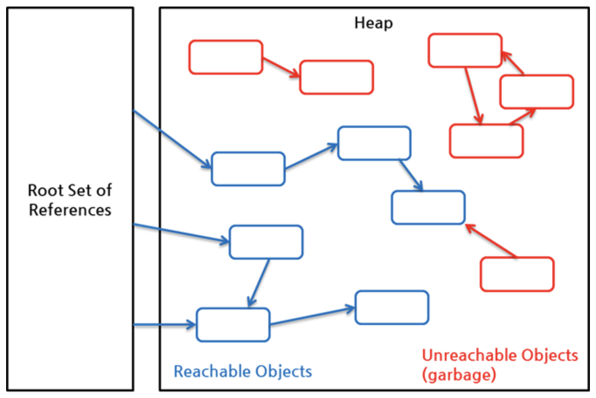

# JVM에서 GC 대상 객체를 판단하는 기준은 무엇인가요?

참조가 끊어졌는지 여부를 판단하여 GC 대상을 결정한다. 참조가 끊어졌다는 것은 객체가 사용되지 않음을 의미하고, 이를 판단하기 위해 \*Reachability(도달 가능성)라는 개념을 사용한다. 이때 도달할 수 없다는 결론을 내린다면 해당 객체는 GC의 대상이 된다.

> **\* reachable과 unreachalbe**  
> reachable이란 어떤 객체에 유효한 참조가 있다는 것을 의미하고 unreachable은 참조가 없다는 것을 의미한다.  
> unreachable 객체를 가비지로 간주해서 GC를 수행한다.

## 도달 가능성(Reachability)는 어떻게 판단하는가?

힙 영역에 있는 객체에 대한 참조는 4가지 케이스가 존재한다.

1. 힙 내의 다른 객체에 대한 참조
2. Java 스택, 즉 Java 메서드 실행 시에 사용하는 지역 변수와 파라미터들에 의한 참조
3. 네이티브 스택, 즉 JNI(Java Natice Interface)에 의해 생성된 객체에 대한 참조
4. 메서드 영역의 정적 변수에 의한 참조

여기서 힙 내 다른 객체에 대한 참조를 제외한 나머지 3개가 \*Root Set으로 Reachability를 판가름 하는 기준이 된다.

root set으로부터 시작한 참조 사슬에 속한 객체들은 reachable 객체이고, 이 참조 사슬과 무관한 객체들이 unreachable 객체로 GC 대상이 된다.
unreachable 객체가 reachable 객체를 참조하더라도, 다른 reachable 객체가 이 객체를 참조하지 않는다면 unreachable 객체이다. 위 그림의 참조는 모둔 java.lang.ref 패키지를 사용하지 않은 일반적인 참조이며, 이를 흔히 strong reference라 부른다. -> 자세한 내용을 아래에서

> **\* Root Set**  
> 한 객체는 여러 다른 객체를 참조하고, 참조된 객체들도 다른 객체를 참조하는 참조 사슬을 이룰 수 있다. 이런 참조 사슬에서 유효한 참조 여부를 파악하려면 **항상 유효한 최초의 참조**가 있어야하는데 이를 객체 참조의 root set이라고 한다.

## 개발자가 GC 대상 판단에 관여할 수는 없나?

자바에서 java.lang.ref 패키지의 SofrReference, WeakReference 클래스를 통해 개발자가 GC 대상 판단에 일정 부분 관여할 수 있다.  
해당 클래스들의 객체(reference object)는 원본 객체(referent)를 감싸서 생성하는데, 이렇게 생성된 객체는 GC가 특별하게 취급한다. SoftReference 객체에 감싸진 객체는 Root Set으로부터 참조가 없는 경우에, 남아있는 힙 메모리의 크기에 따라 GC 여부가 결정된다. 반면, WeakReference 객체에 감싸진 객체는 Root Set으로부터 참조가 없는 경우, 바로 GC 대상이 된다.

# 더 자세히

## Soft, Weak, Phantom Reference

...
