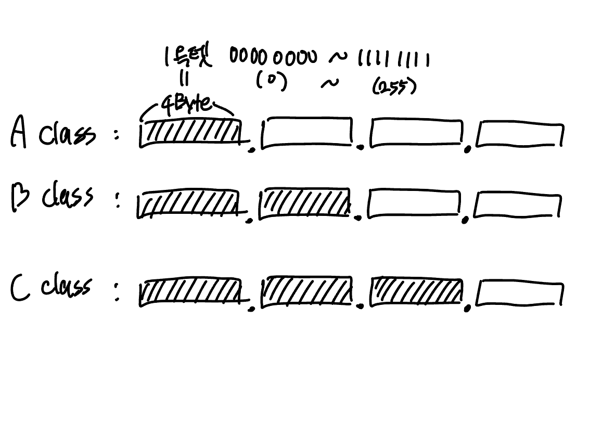

# 클래스풀 IP 주소 체계에 대해서 설명해주세요.

클래스 풀 주소 체계(Classful Addressing)은 IP 주소를 규격화된 크키별로 구분시키는 방식입니다. IP 주소를 클래스(A, B, C등)별로 규격화(유형화)시켜, 쉽게 식별할 수 있도록 합니다.

```
IPv4 주소는 4바이트(32비트)이며, 1바이트씩 끊어서 표기합니다. 이때 각 바이트를 옥텟이라고 부르며, 각 옥텟은 0부터 255까지의 숫자를 표현할 수 있습니다. ex)0.0.0.0 ~ 255.255.255.255
```



- A 클래스는 초기 비트가 0(2진수)으로 시작하는 1옥텟을 네트워크 주소로 사용하고, 3옥텟을 호스트 주소로 사용합니다. 호스트 주소의 0 과 255는 특수한 용도(전자는 네트워크 식별, 후자는 브로드캐스트 주소)로 사용되므로, A클래스에서는 2^7개의 네트워크 수와 2^24 - 2개의 호스트 주소를 가질 수 있습니다.
- B 클래스는 초기 비트가 10(2진수)으로 시작하는 2 옥텟을 네트워크 주소로 사용하며, 2 옥텟을 호스트 주소로 사용합니다. 따라서 B 클래스에는 2^14개의 네트워크가 2^16 - 2개의 호스트를 가질 수 있습니다. (10xxxxxx.xxxxxx -> 네트워크 주소)
- C 클래스는 초기 비트가 110(2진수)으로 시작하는 3옥텟을 네트워크 주소로 사용하며, 1 옥텟을 호스트 주소로 사용합니다. 따라서 C 클래스에는 2^21개의 네트워크와 2^8 - 2개의 호스트 주소를 가질 수 있습니다.

아래 표는 클래스별 1 Byte 범위입니다.  
| 1 Byte | 10진수 | 2진수 |
| ------- | --------- | ------------------- |
| Class A | 0 ~ 127 | 00000000 ~ 01111111 |
| Class B | 128 ~ 191 | 10000000 ~ 10111111 |
| Class C | 192 ~ 223 | 11000000 ~ 11011111 |

클래스풀 주소 체계는 클래스 별로 네트워크 크기가 고정되어 있기 때문에 다수의 IP 주소가 낭비될 수 있다는 한계점이 존재합니다. 예를 들어, 특정 조직에 컴퓨터가 255개라면 C 클래스 주소를 사용하지 못하고(호스트 주소가 2^8-2 개 밖에 할당하지 못해서), B 클래스를 사용해야하는데, 이러한 상황에서 IP 주소의 낭비가 발생할 수 있습니다. 클래스 풀에서는 한개의 클래스 네트워크가 한 조직에게 할당되어지면, 남은 주소가 발생하더라도 해당 네트워크주소를 가진 IP를 다른 기관이 사용할 수 없었습니다.

이러한 문제를 해결하고 더욱 유동적인 방식의 네트워크를 구획할 수 있도록 클래스리스 주소 체계가 등장했습니다.

## 클래스리스 주소 체계란?

클래스리스 주소 체계(Classless Addressing) 클래스가 아닌 서브넷 마스크를 이용해 네트워클 주소화 호스트 주소를 구분하는 IP 주소 체계입니다.
이때, 서비넷 마스크는 네트워크 구분을 위한 비트열을 의미합니다.
해당 비트열에서 네트워크 주소는 연속된 1(이진수), 호스트 주소는 연속된 0(이진수) 으로 표현합니다. 특정 IP 주소와 서브넷 마스크를 비트연산을 수행하면, 네트워크 주소를 알아낼 수 있습니다.  
예를 들어, 서브넷 마스크가 255.255.255.0, IP 주소가 168.168.168.168인 경우, 비트연산을 수행하면 네트워크 주소인 168.168.168.0을 알아낼 수 있습니다. 이 경우 1옥텟을 호스트 주소로 사용할 수 있습니다.

서브넷 마스크를 표기할 때는 CIDR(Classless Inter Domain Routing Notation) 표기법을 사용할 수 있습니다. 표현 방식은 `{IP주소}/{서브넷 마스크 비트열의 1의 수}` 형식으로 표현합니다.  
IP 주소가 168.168.168.168이며, 서브넷 마스크가 255.255.255.0인 경우에는 168.168.168.168/24와 같이 표기할 수 있습니다.
