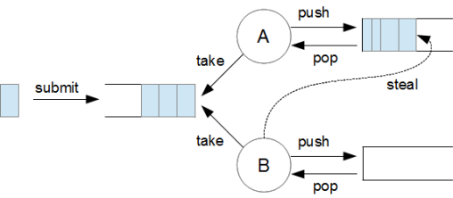

## ForkJoinPool

자바에서 제공하는 비동기 프레임워크로, 분할-정복 알고리즘을 활용하여 작업을 효율적으로 분산하고 병렬로 실행하는 스레드 풀이다.
이 스레드 풀은 큰 작업을 여러 작은 sub Task 분리(Fork)하고, 각각을 병렬로 처리한 후 그 결과를 다시 합쳐(Join) 최종결과를 생성하는 방식으로 동작

### Work-Stealing 매커니즘을 사용

1. submit()을 통해 task를 내보낸다
2. 인바운드 큐에 task가 들어가고, A와 B 스레드가 task를 처리한다.
   
3. A와 B는 각자 큐가 있으며, 위의 그림의 B처럼 큐에 Task가 없으며 A의 task를 steal하여 처리한다.
