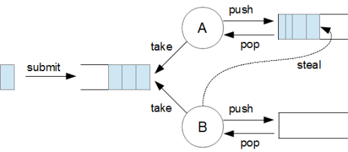

## CompletableFuture에서 기본으로 적용되는 ForkJoinPool이 아닌 ThreadPoolTaskExecutor를 사용한 이유

## ForkJoinPool

자바에서 제공하는 비동기 프레임워크로, 분할-정복 알고리즘을 활용하여 작업을 효율적으로 분산하고 병렬로 실행하는 스레드 풀이다.
이 스레드 풀은 큰 작업을 여러 작은 sub Task 분리(Fork)하고, 각각을 병렬로 처리한 후 그 결과를 다시 합쳐(Join) 최종결과를 생성하는 방식으로 동작

### Work-Stealing 매커니즘을 사용

1. submit()을 통해 task를 내보낸다
2. 인바운드 큐에 task가 들어가고, A와 B 스레드가 task를 처리한다.
   
3. A와 B는 각자 큐가 있으며, 위의 그림의 B처럼 큐에 Task가 없으며 A의 task를 steal하여 처리한다.

Work-Stealing 매커니즘을 사용하기 때문에 CPU 자원이 놀지 않고 최적의 성능을 낼 수 있게 해준다.

### ForkJoinPool과 CompletableFuture의 연계

java8 부터 CompletableFuture는 ForkJoinPool을 사용하여 비동기 작업을 처리한다. 기본적으로 CompletableFuture는 ForkJoinPool.commonPool() 을 사용하여 스레드 풀을 가져오고 사용한다.
디폴트 스레드 개수는 코어개수 \* 2 - 1 이다.  
[CompletableFuture와 ForkJoinPool](https://jwooo.tistory.com/3)

### [ThreadPoolExecutor 와 ForkJoinPool](https://hamait.tistory.com/612)

ThreadPoolExecutor는 보통 스레드 풀이라고 생각하면 된다.  
**보통 스레드풀 동작**

1. 스레드가 작업할 작업 3개를 스레드를 할당 받을 수 있도록 대기큐에 넣어준다.
2. 스레드 풀에서 일을 하지 않는 스레드가 큐에 있는 작업을 하나씩 꺼내서 실행한다.
3. 스레드를 배분 받은 일을 한다.
   여기서 문제인 점은 스레드 A가 받은 작업이 오래걸리는 작업이고, B와 C가 받은 작업은 빨리 끝나는 작업이라면 A는 작업중인데, B와 C는 놀고 있다.
   위와 같이 쓰레드를 효율적으로 사용하지 못하고 있는데, 이런 경우를 해결하기 위해 나온게 ForkJoinPool이다.

**ForkJoinPool**  
이 쓰레드 풀을 쓰레드마다 개별 큐를 가지고 있다. inbound queue 라는 공용 편지함에 작업이 왔을 때, 그 작업에 대한 경쟁으로 인한 시간을 낭비하는 것을 방지하기 위해 개별 큐가 있는 것이다.

1. 보통 스레드 풀에 3개의 작업이 개별로 전달되었는데, 여기서는 3개의 작업을 하나의 작업으로 묶어서 대기큐에 넣는다.
2. 스레드 A가 하나의 잡을 자신의 로컬 큐에 1차 분할을 한다.
3. 스레드 B가 놀고 있으므로 A가 분할한 작업을 stealing한다.
4. 스레드 B도 작업을 분할하고, 스레드 C가 놀고 있으므로 B의 작업을 stealing
5. 이렇게 3개의 스레드가 동일한 양의 작업을 수행하게 된다.

#### ForkJoinPool이 무조건 좋은가?

이 스레드풀은 스레드마다 개별 큐가 생성된다고 하였다. 만일 3개의 작업량이 모두 동일한데 ForkJoinPool을 사용하면 오히려 독이다. 일반 스레드 풀을 사용해서 각각 스레드에게 작업을 할당해도 스레드 처리량은 비슷할 것이다.  
근데 ForkJoinPool을 사용하면? 쓸데없는 개별 큐를 생성해서 사용하므로 시간이 더 걸릴 것이다.

## ThreadPoolTaskExecutor

> Java의 ThreadPoolExecutor의 속성값을 쉽게 조정할 수 있고, 빈으로 등록하여 Spring TaskExecutor로 사용할 수 있다.

```java
@Bean
	public ThreadPoolTaskExecutor taskExecutor() {
		ThreadPoolTaskExecutor executor = new ThreadPoolTaskExecutor();
		executor.setCorePoolSize(100);  // 기본 스레드 수
		executor.setThreadNamePrefix("Async-");
		executor.setRejectedExecutionHandler((r, exec) -> {
			throw new IllegalArgumentException("더 이상 요청을 처리할 수 없습니다.");
		});
		return executor;
	}
```

setCorePoolSize: 동시에 실행할 기본 스레드수, 디폴트 1  
setMaxPoolSize: 스레드 풀의 크기, 기본값은 Integer.MAX_VALUE이다.
