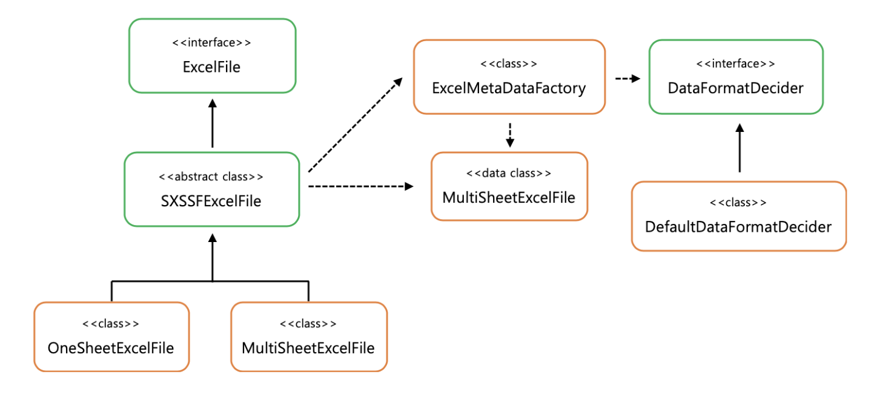

## 코드의 문제점

각 서비스마다 엑셀파일을 생성하기 위해 사용되는 DTO, 엑셀 헤더와 바디를 생성하기 위해 반복되는 코드, 기능을 새로 추가될때마다 동일한 로직이 또 추가...

## 생각해볼 점

- 엑셀 다운로드에 사용되는 POI모듈을 그냥 사용하면 일반 AP를 개발하는 것보다 추가적인 공수가 많이 들고, 엑셀 다운로드 기능끼리 공통 코드를 공유하기가 어려움 -> 현재 코드에서 어느정도 해결했다고 생각해서 포폴에 적용
- 엑셀 다운로드 기능이 매 feature마다 필요하였다.
- 엑셀에 디자인이 요구되는 경우가 생긴다면 코드가 더 복잡해지고 반복될 것이다
- 대용량 엑셀파일을 생성해야하는 경우 발생하는 문제점

## 해결

리플렉션으로 정적인 DTO를 사용하지 않고, 동적으로 객체 타입을 조회하여 엑셀파일 생성

# 아직 해결하지 못한 문제 해결해보기 -> [자료](https://techblog.woowahan.com/2698/) 참고해서 직접 적용해보기

## 새로운 엑셀 모듈 개발해보기

### 어노테이션과 리플렉션을 이용하기

> 목표: column에 getter를 사용해서 Cell을 하나씩 만들어줄 필요가 없도록 한다.

해결 방법: Java의 어노테이션과 리플렉션 활용

1. @ExcelColum 구현
   JPA 에서 DB column을 @Column으로 표시하는 것과 비슷하게 DTO에서 엑셀에 표시하고 싶은 필드를 @ExcelColum으로 표시하는 방법. headerName이라는 필드로 해당 필드의 헤더에 들어갈 이름을 정해줄 수 있다.

```java
@Target(ElementType.FIELD)
@Retention(RetentionPolicy.RUNTIME)
public @interface ExcelColumn {

  String headerName() default "";

}
```

```java
public class CarExcelDto {
    @ExcelColumn(headerName = "회사")
    private final String company;

    @ExcelColumn(headerName = "차종")
    private final String name;

    @ExcelColumn(headerName = "가격")
    private final int price;

    @ExcelColumn(headerName = "평점")
    private final double rating;
}
```

2.DTO 객체를 받아 엑셀을 그려주는 ExcelFile 구현
대용량 엑셀파일을 위해 스트리밍 방식으로 동작하는 POI Workbook의 구현체로 SXSSFWorkbook을 선택(자세한 내용은 [이글](./교보DTS.md)을 참고하자)

```java
private void renderBody(Object data, int rowIndex, int columnStartIndex) {
    Row row = sheet.createRow(rowIndex);
    int columnIndex = columnStartIndex;
    for (String dataFieldName : excelResource.getDataFieldNames()) {
      Cell cell = row.createCell(columnIndex++);
      try { // (3)
        Field field = getField(data.getClass(), (dataFieldName));
        field.setAccessible(true);
        renderCellValue(cell, field.get(data));
      } catch (Exception e) {
        throw new ExcelInternalException(e.getMessage(), e);
      }
    }
  }

  private void renderCellValue(Cell cell, Object cellValue) {
    if (cellValue instanceof Number) { // (4)
      Number numberValue = (Number) cellValue;
      cell.setCellValue(numberValue.doubleValue());
      return;
    }
    cell.setCellValue(cellValue == null ? "" : cellValue.toString());
  }
```

리플렉션을 이용해 Excel파일의 Body를 그려주는 부분이다.
cell.setCellValue()를 사용할 때 타입이 어떻게 들어오냐에 따라 Cell에서 표시형식을 정하고 있다. setCellValue만으로 표시형식이 정해지는 것은 아니지만 setDataFormat과 복합적으로 사용하게 된다.

### 컨트롤러에 적용해보자

```java
@GetMapping("/api/v2/excel/car")
public void downloadCarInfo(HttpServletResponse response) throws IOException {
  List<CarExcelDto> carExcelDtos = carService.getCarInfo();
  SimpleExcelFile<CarExcelDto> excelFile = new SimpleExcelFile<>(carExcelDtos, CarExcelDto.class);
  excelFile.write(response.getOutputStream());
}
```

### Type 별 데이터 포맷 지정

-> 교보DTS에 포맷을 지정해야할 게 있는지 보자 -> 우선순위? 별로 정렬하려면 숫자여야하나

### 여러 종류의 ExcelFile이 필요

현재는 약 100만 row까지만 출력할 수 있지만 더 많은 데이터를 출력해야하는 엑셀이 필요할 수 도있다..  
또한, 계속해서 변형된 엑셀파일이 필요해질 수도 있다. 암호화를 해야하는 엑셀, 정해진 템플릿을 이용하는 엑셀, 여백이 필요한 엑셀 등  
기존에 만들었던 SimpleExcelFile을 추상화하자

```java
public abstract class SXSSFExcelFile<T> implements ExcelFile { // (1)

  protected static final SpreadsheetVersion supplyExcelVersion = SpreadsheetVersion.EXCEL2007;

  protected SXSSFWorkbook wb;
  protected Sheet sheet;
  private SimpleEcxelMetaData excelMetaData;

  public SimpleExcelFile(List<T> data, Class<T> type, DataFormatDecider dataFormatDecider) {
    validateMaxRow(data);
    this.wb = new SXSSFWorkbook();
    this.excelMetaData = SimpleExcelMetaDataFactory.getInstance().createMetaData(type, wb, dataFormatDecider);
    renderExcel(data);
  }

  protected void validateMaxRow(List<T> data)

  protected abstract void renderExcel(List<T> data); // (2)

  // (3)
  protected void renderHeaders(Sheet sheet, int rowIndex, int columnStartIndex) {
    Row row = sheet.createRow(rowIndex);
    int columnIndex = columnStartIndex;
    for (String dataFieldName : resource.getDataFieldNames()) {
      Cell cell = row.createCell(columnIndex++);
      cell.setCellStyle(resource.getCellStyle(dataFieldName, ExcelRenderLocation.HEADER));
      cell.setCellValue(resource.getExcelHeaderName(dataFieldName));
    }
  }

  protected void renderBody(Object data, int rowIndex, int columnStartIndex) {
    Row row = sheet.createRow(rowIndex);
    int columnIndex = columnStartIndex;
    for (String dataFieldName : resource.getDataFieldNames()) {
      Cell cell = row.createCell(columnIndex++);
      try {
        Field field = getField(data.getClass(), (dataFieldName));
        field.setAccessible(true);
        cell.setCellStyle(resource.getCellStyle(dataFieldName, ExcelRenderLocation.BODY));
        renderCellValue(cell, field.get(data));
      } catch (Exception e) {
        throw new ExcelInternalException(e.getMessage(), e);
      }
    }
  }

  private void renderCellValue(Cell cell, Object cellValue) {
    if (cellValue instanceof Number) {
      Number numberValue = (Number) cellValue;
      cell.setCellValue(numberValue.doubleValue());
      return;
    }
    cell.setCellValue(cellValue == null ? "" : cellValue.toString());
  }

  @Override
  public void write(OutputStream stream) throws IOException {
    wb.write(stream);
    wb.close();
    wb.dispose();
    stream.close();
  }

}
```

1. 엑셀 파일이 꼭 가져야할 인터페이스이다. 주어진 Stream에 엑셀 파일을 쓸 수 있어야한다.

```java
public interface ExcelFile {

  void wirte(OutputStream stream) throws IOException;

}
```

2. 구현 클래스에서 사용할 훅 메소드입니다.
3. 하위 구현체들에서 자유롭게 사용할 수 있는 공통 메소드들입니다. 헤더를 그리거나 바디를 그리는데 활용할 수 있습니다.

이제 추상화된 SXSSFExcelFile을 상속받아 언제 새로운 Sheet를 만들지, 언제 어디에 헤더와 바디를 그릴지 결정해주는 부분을 하위 구현체에 넣어줄 수 있습니다

아래는 각각 한 Sheet에만 데이터를 그릴 수 있는 엑셀 파일과 여러 Sheet에 데이터를 그릴 수 있는 엑셀 파일

```java
public final class OneSheetExcelFile<T> extends SXSSFExcelFile<T> {

  // 클래스 필드 및 생성자 생략

  @Override
  public void renderExcel(List<T> data) {
    sheet = wb.createSheet();
    renderHeaders(sheet, ROW_START_INDEX, COLUMN_START_INDEX);

    if (data.isEmpty()) {
      return;
    }

    int rowIndex = ROW_START_INDEX + 1;
    for (Object renderedData : data) {
      renderBody(renderedData, rowIndex++, COLUMN_START_INDEX);
    }
  }

}
```

```java
public final class MultiSheetExcelFile<T> extends SXSSFExcelFile<T> {

  // 클래스 필드 및 생성자 생략

  @Override
  protected void renderExcel(List<T> data) {
    createNewSheetWithHeader();

    if (data.isEmpty()) {
      return ;
    }

    int renderedDataCnt = 0;
    int rowIndex = ROW_START_INDEX + 1;
    for (Object renderedData : data) {
      renderBody(renderedData, rowIndex++, COLUMN_START_INDEX);
      renderedDataCnt++;

      if (renderedDataCnt == maxRowCanBeRendered) {
        renderedDataCnt = 0;
        rowIndex = 1;
        createNewSheetWithHeader();
      }
    }
  }

  private void createNewSheetWithHeader() {
    sheet = wb.createSheet();
    renderHeaders(sheet, ROW_START_INDEX, COLUMN_START_INDEX);
  }

}
```

위 두 개의 클래스를 하나의 ExcelFile로 줄일 수 있는 방법은? -> 생각해보기

지금까지 언급된 엑셀 렌더링 담당 객체간의 관계이다.


### 지금까지 만들어진 모듈의 성능 분석 그리고 장단점 -> 해보기

시간 및 성능은 jstat로 측정
**적은 양의 데이터**

- 1,000개의 cell 렌더링(10 필드, 100건)
- Xms, Xmx 설정 없음.
  **많은 양의 데이터**
- 10,000,000갱의 cell 렌더링 기준(10개 필드, 100만건)
- Xms 1GB, Xmx 2GB

```
엑셀 모듈 개발의 모티브는 ‘엑셀 다운로드 기능을 빠르고 편리하게 개발하자’였습니다. 실제로 기존의 엑셀 구현 방식보다는 개선된 모습을 보여주었죠. 하지만 좋은 점이 있으면, 아쉬운 점이 있는 법.
새로 만든 모듈은 엑셀 파일 생성 시간이 조금 더 걸리고 메모리를 조금 더 많이 사용하는 모습을 보여줬습니다.
많은 수의 일반 유저가 동시에 엑셀을 다운로드 받아야 하거나 대용량의 데이터를 빠른 시간 내에 처리하는 경우라면 클라이언트 엑셀 렌더링과 같은 아예 다른 방법을 써야 겠지만, 내부에서 사용하는 어드민이나 통계성 자료를 추출하는데는 적극적으로 활용될 수 있을겁니다. 어드민에 통계 자료가 많고 엑셀 기능이 수십개 있는 저희팀에 알맞은 조건이죠.
제가 정말 존경하는 한 분은 예전에 이런 글을 남겨주셨습니다.

'''
시스템 최적화의 기본 원칙이 있다
Common Case를 단순하고 빠르게 만들고
Uncommon Case는 복잡하고 느려도 된다는 것
''''

서비스 이용자가 자주 쓰는 기능은 시간이 오래 걸리더라도 리스스를 많이 투입하여 퍼포먼스를 높이고,
내부 구성원이 가끔 사용하는 기능은 리소스를 상대적으로 적게 투입해서 다른 핵심 기능에 대한 리소스를 아끼는 것이죠.
물론 그 후, 필요한 부분은 여유가 될때 점진적으로 개선해나가야 할 것입니다.
```
