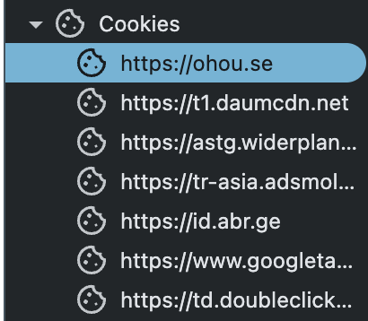

참고: https://www.devyummi.com/page?id=68383334179e44fc8b38f737

# CSRF

> Cross Site Request Forgery

**로그인된** 사용자에게 사용자가 원하지 않지만, 해커가 **원하는 요청을 유도**하는 공격 기법으로 로그인 사용자가 ADMIN 과 같은 권한을 가지면 큰 피해를 입을 수 있다.

쿠키의 특성을 알았으니, 해커가 원하는 요청을 “로그인된” 사용자를 통해서 요청하는 방법에 대해 알아보자(해커 관점에서 웹의 취약점을 어떻게 이용할지 생각해보는 시간)

## 취약점1: GET 요청 URI에 행위가 나타나는 케이스

서버는 https://weak.server.com/modified?password=1234

이런 요청을 받으면 비밀번호를 변경하는 작업이 일어난다고 가정해보자.

위 경로의 요청은 로그인된 사용자에게만 인가 권한이 주어집니다.

GET 요청 URI 행위 취약점을 통해 해커가 로그인된 사용자에게 저 경로를 실행하게 할 수 있다.

1. 위 주소 요청을 보내는 HTML 태그를 만든다.
   - `<a>`태그 href=”데이터변경 요청 주소”
   - `` 태그 src=”데이터변경 요청 주소”
2. 해당 태그에 달린 주소의 행위를 수행할 수 있는 유저에게 보낸다.
   1. 이메일
   2. 공개된 게시판

### 보안방법

- GET 요청 URI일때 CRUD 중 Read 이외의 행위가 들어가면 안된다.
- 쿠키 보안 옵션 중에 sameSite 속성을 Strict, Lax로 설정하여 퍼스트 파트 쿠키만 허용, 또는 서드파트 쿠키라도 특수 케이스시에 부분 허용할 수 있다.(서드파트 쿠키, 퍼스트파트 쿠키 이해 필요, 아래에서 설명)

실제로 2008년에 옥션이 당했던 방식이다. 옥션 계정 비밀번호를 변경하는 로직이 URI 쿼리 파라미터 기반이었고, 해커가 ``에 비밀번호 변경 URI를 심어 어드민 계정에 이메일을 보냄으로 공격이 성공하였다.

> ### 서드파트 쿠키와 퍼스트파트 쿠키
>
> 서드파트 쿠키와 퍼스트 파트 쿠키에 대해 이해하려면 쿠키 도메인과 사이트 도메인에 대한 이해가 필요하다. 퍼스트파티, 서드파티 판단은 Site Domain 과 Cookie Domain 의 일치여부로 결정된다.
>
> - **Site Domain** : 현재 유저(내)가 보고있는 웹 브라우저창에 뜬 **도메인명**
> - **Cookie Domain** : 쿠키에 설정되어있는 Domain + Path 값에 명시된 **도메인명**
>
> **퍼스트파티 쿠키**: cookie domain = site domain (개발할때 localhost로 리액트와 스프링이 소통한다 → 동일하므로 퍼스트 파티 쿠키 맞다.
>
> **서드파트 쿠키**: cookie domain ≠ site domain: https://ohou.se 제외하고 모두 서드파트쿠키이다.
> 

### 취약점2: From 요청 hidden

Post 기반 Form 태그 기반으로 요청을 보낸다고 해보자. 이 또한 CSRF 공격으로부터 안전하지 못하다.

1. 파라미터를 hidden type으로 숨긴 Form 태그를 만든다.
   1. 수동으로 버튼 클릭
   2. 자동으로 버튼 활성
2. 해당 Form을 권한이 있는 유저에게 보냄
   1. 이메일
   2. 공개된 게시판

### 보안 방법

CSRF 토큰으로 방어할 수 있습니다. 흔히 스프링 시큐리티 설정파일에서 필터페인 작성시 csrf() 설정을 추가하는 것이 csrf 토큰을 검증하는 로직을 추가하는 것입니다.

서버는 로그인한 유저에게 고유의 난수 CSRF 토큰을 발급합니다. 이후 서비스 개발자들이 만든 Form 태그는 해당 CSRF 토큰은 hidden 파라미터로 담도록 설계합니다. (SSR일 경우)

해커가 만든 Form 태그는 CSRF 토큰을 담지 못하기 때문에 Form 요청시 인가가 거부됩니다. (서버가 만든 CSRF 토큰이 없으므로 요청이 거부되는 로직을 만들어야한다)

> 참고로 form 데이터 요청은 쿼리 파라미터로 전달됩니다.

## 세션 인증 방식을 경우 위험성

위 두가지 취약점은 서비스의 인증 방식이 세션일 경우 특히 유효합니다.

쿠키-세션 인증 방식에서 해당 공격에 노출 될 수 있다.

- 쿠키-세션 방식 인증

  세션 방식 인증은 쿠키(톰캣의 경우 JSESSIONID)에 세션 id를 넣어주어서, 그 쿠기에 대응하는 정보를 서버 메모리(세션)에 저장합니다.

  이때, 쿠키는 브라우저 요청에 포함되어 자동 전송됩니다. (쿠키 옵션을 주어 제외하는 요청도 있다)

- JWT 방식
  반면 JWT 방식 인증은 로그인을 마친 유저에게 JWT를 발급하고, 인증이 필요할 때 서버측으로 JWT를 보내지만,

  JWT의 저장 특성상 로컬스토리지에 저장하기 때문에 쿠키 방식이 아니어서 자동으로 요청에 따라가지 않습니다.

**자동으로 전송되는 쿠키의 특성** 때문에 보안 공격에 노출될 수 있다는 점이다.

이를 통해 인증용 쿠키 /JWT가 자동으로 따라가는지 여부에 따라 결국 CSRF의 위험성이 달라집니다.
자동으로 따라가는 것은 결국 해커가 만든 트랩에서도 인증을 할 수 있는 요소가 따라가는 것이기 때문이다.

**그럼 JWT는 항상 안전한가요?**
JWT를 발급하면 프론트가 로컬 스토리지에 저장하게 된다. 로컬 스토리지에 저장한 JWT는 요청 시 js 코드 기반으로 꺼내 axios난 fetch에 붙이게 됩 니다.
우리 서비스가 "의도한 요청"은 위 작업을 구현하지만, 해커가 만든 위조 요청은 저것을 구현하기가 어렵다. 따라서 jwt는 CSRF 공격으로부터 세션 방식에 비해 안전하다고 할 수 있다.
다만, JWT를 로컨 스토리지가 아닌 쿠키에 저장하게 되면, 그리고 쿠키가 모든 요청에 항상 따라가는 경우 CSRF 공격에 조심해야하는 것은 마찬가지 이다..(Refresh용 토큰 제외)
Refresh용 토큰은 토큰을 재발급해주는 용도이기 때문에 쿠키에 얺어도 인증 과정을 진행하지 않으므로 위험하지 않다고 볼 수 있다.
하지만 XSS 공격에 노출된다는 점..

**쿠키가 자동으로 전송되는 문제가 약점이라면 브라우저 저장소에 localStorage도 있는데 거기에 저장하며 되지 않나? 할 수도 있지만 이 두개의 저장소 사용 목적이 다르다.**

## storage와 쿠키를 사용하는 목적

Storage (HTML5 표준) 등장 전에는 웹 브라우저 저장소는 유일하게 Cookie 만을 활용해야했다
Storage (HTML5 표준) 등장 후에는 웹 브라우저에서 아래 두 유즈케이스를 제대로 나눠 활용할 수 있게 된다

**Storage(localStorage, sessionStorage)**: 유저에 의해 변경된 옵션 상태 등 → 필요에 따른 조회가 필요할때 (진짜 저장소)

- 예를 들어서 마지막으로 로그인한 정보를 저장해서 다시 접속했을 때 알려주는 용도, 테마 적용 등

**Cookie**: 웹 서버에게 웹 브라우저가 매번 전달할 특정 정보를 위한 저장소 (Stateful)

- 매번 요청에 필요한 로그인 인증 정보 저장 -> 서버에 요청을 할 때 매번 포함되도록 하기 위해 쿠키 활용

위와 같이 저장소가 나눠진 목적이 분명하므로 우리는 인증 정보를 쿠키에 저장하면 된다.

### 세션 기반 인증 방식에서 로컬 스토리지를 이용하지 않는 이유(정리)

가장 큰 이유는 보안 때문이다.

1. 보안 옵션을 제공하지 않음: 쿠키는 sameStie(CSRF 방지), httpOnly(js 조작 불가, XSS 방지), Secure(HTTPS 기반 통신) 등 보안에 필요한 옵션을 제공해줍니다. 로컬 스토리지는 js코드를 삽입해서 세션 ID를 탈취할 수 있다.
2. 만료 시간을 관리하기 어려움: 쿠키는 Max-Age나 Expires 로 만료 시간을 설정하여 브라우저가 자동으로 관리해줄 수 있다. 로컬 스토리지는 만료 시간 관리는 개발자가 직접 구현해야하므로 복잡성이 증가하고, 특히!!! 오류 발생 가능성이 있다. 3.모든 요청에 자동으로 전송되지 않는다.

### 쿠키가 제공하는 옵션

1. Mas-Age/Expires: 명시가 안되어 있으면 세션 쿠키, 명시되어 있으면 persistent Cookie
   - 세션: 열고 닫힘의 하나의 pair에 모두 사용
   - Http 세션: tcp/udp 연결 후 request 전송 후 response 받기가지
   - 브라우저 세션: 하나의 탭 / 창이 열리고 닫히지 전까지
2. HttpOnly: XSS(자바스크립트) 공격에 의한 쿠키 제어 -> 개발 시 로그아웃 후 클라이언트에서 JS로 쿠키 만료하려니까 안된이유이다.
3. Secure: 패킷 탈취(Man In The Middle) 방지를 위해 HTTPS 채널에서만 사용 가능(MITM 방지)
4. SameSite: 웹 브라우저 주소란에 표시된 도메인과 동일한 도메인에 대한 요청 시에만 쿠키를 전송하게 한다.

- strict: 퍼스트파트 쿠키 전송만 허용
- Lax: 서트파트 쿠키라도 특수 케이스시에 부분 허용
- None: 서드파트 쿠키 모두 허용하는데, 크롬은 None으로 설정하려면 Https를 강제한다. 따라서 MITEM 문제를 방지한다.

근데 여기서 Https로 설정을 강제해도 안전하다고 할 수 있을까?
**공격에 대해 완전히 방어할 수 있다고 확신하기 어렵다**  
HTTPS를 사용해도 서드파트 쿠키가 로그인, 인증 정보를 담고 있다면 어드민 API도 호출이 가능하다. 그래서 크로스 사이트에 해당하는 쿠키(서드파트쿠키)라 할지라도 전송되지 않게 막을 필요가 있다.

실제로 웹 사이트에 방문할 때 아래와 같은 쿠키 허용하라는 창을 본적이 많을 것이다.  
  
위 사진에서 필수 쿠키는 퍼스트파트 쿠키이고, 성능 관련 쿠키와 광고 쿠키는 서드파트 쿠키이므로 사용자가 선택하도록 하였다. 서드파트 쿠키를 허용하면 CSRF 공격에 노출될 수 있다는 점이고, 이걸 사용자가 선택할 수 있도록 한것이다.

# XSS

참고: https://www.devyummi.com/page?id=683905a7f6fd2df7c0214b86

> Cross Site Scripting

XSS는 해커가 웹 서비스에 정보를 탈취할 수 있는 JS 로직을 삽입하여, 정상저긴 유저가 그 로직을 실행하면서 발생하는 해킹 기법이다.

유저가 서비스를 이용하다가 해컥 심어놓은 JS 로직이 실행되면서 해커쪽으로 정보가 넘어가는 공격.
해커가 유저를 거치는 요청이 아니라 직접 화면에서 악성 스크립트를 작성해서 서버에 영향을 미치는 것이라고 생각하자
탈취되는 정보는 주로 쿠키, JWT와 웹 브라우저 저장소에 저장된 값이다.

> 참고: 풀네임은 Cross Site Scripting 인데, 왜 XSS로 불리는 걸까? 이는 HTML/CSS의 CSS 가 너무 널리 알려져 있어서 혼동을 피하기 위해 XSS로 표기한다.

## XSS 공격 종류

세가지 공격 기법 모두 비슷하게 흘러간다. 취야한 부붑에 JS 로직을 삽입해서 유저의 정보를 빼내어 해커에게 전달되는 흐름이다.

### Reflected(SSR 서비스인 경우)

프론트 입력 창에 JS 입력값이 백엔드 API로 보내진 후, 컨트롤러에서 그 값을 그대로 VIEW에 넣어져 뷰가 로딩될 때 악성 JS 실행.

**실행 원리**

```java
@Controller
public class SearchController {

    @GetMapping("/search/{query}")
    public String search(@PathVariable String query, Model model) {

        model.addAttribute("query", query);

        return "search";
    }
}
```

포털 서비스에 위와 같은 컨트롤러가 있다고 가정해보자. 쿼리 파라미터로 포털창에 검색된 스크립트가 넘어가는 구조이다.

그래서 포털에서 악성 JS 가 로딩될 수 있는 로직을을 작성해서 포털 검색을 한다면, model에 들어가게 고, 뷰가 로딩되면서 악성 JS가 자동으로 실행되게 된다. 그러면 악성 JS에 노출이된다

### 해결 방법1.

> 프론트에서 해결하는 방법

프론트로부터 넘어오는 입력 값에 JS 값이 포함되는 지 검증한다.  
이름 입력 창, 이메일 창과 같이 명확한 입력 형태가 있을 경우 백엔드 단에서 입력 형태를 검증해서 2중 검증을 한다.

### 해결 방법 2.

> 백엔드에서 막는 방법(프론트에서 막는다해도 다른 클라이언트를 이용해서 보내면 백엔드는 열려 있으므로 공격에 취약)

위와 같이 쿼리로 데이터가 넘어온다면 쿼리를 검사해서 악성 코드가 있다면 조건문이나 레직스(Regex)로 제거해야한다.

> Regex: Refular Expression의 약자로, 정규 표현식이라는 뜻이다. 텍스트에서 특정한 패턴을 찾거나 변경할 때 유용하다.

스프링의 경우 `mustache{{}}`, `타임리프 th:text`, `리액트 {}` 이런 괄호들이 동적 데이터를 로딩하게 되는데, 여기에 자바 스크립트가 담겨있다고 하면 스트링으로 변환하여 로딩하게 해준다.

하지만 `mustach{{{}}}`, `타임리프:utext`, `리액트 dangerouslySetInnerHTML` 은 스트링으로 변환해주는 것을 지원하지 않는다.

## DOM based XSS(CSR에서 서버로 넘어가지 않고 클라이언트 측에서 발생)

프론트의 입력값에 악성 JS를 넣어 그 값이 DOM에 로딩된다. 위의 Reflected 와 흡사하지만, Reflected는 서버로 보내진 값이 DOM에 로딩되는 것이고, 이 방법은 JS가 바로 DOM에 적용되어 바로 로딩되는 것이다.

**실행 원리**

```html
<script>
  const params = new URLSearchParams(location.search);
  const name = params.get("name");
  document.getElementById("user").innerHTML = name;
</script>
```

URL쿼리 파라미터에 악성 코드가 담길 수 있고, name이라는 파라미터에 악성 코드가 담겨 있다면, name이라는 파라미터의 값을 가지고 InnerHTML을 통해서 악성 JS 코드를 삽입할 수 있다. DOM의 특정 엘리먼트에 innerHTML로 JS 값을 부여하면 자동으로 JS를 해석하고 실행한다.

**해결 방법**

```html
element.textContent = userInput;
```

textContent로 로딩을 하지않고, 스트링으로 처리아혀 해결 가능

## Stored XSS

Reflect XSS처럼 Controller에서 바로 로딩하는 것이 아니라, DB 까지 가서 저장이되는 것이다.
게시글 작성 같은 경우 DB 접근을 할 것이고, 저장된 악성 JS를 호출하면서 뷰에 로딩될 것이고 이때 악성 코드가 실행된다.
Reflect와 다른 점은 요청시 바로 로딩되는 것이고, Stored는 DB에 저장되었다가 저장된 악성 코드가 포함된 데이터에 접근하여 뷰에 로딩하는 순간 그때 악성 스크립트가 실행된다.(게시글을 작성하는 로직에 악성 스크립트 심어서 DB에 저장되게 하였다가, 해당 게시글 조회하는 사람에 의해 로딩이 되면서 악성 스크립트 실행)

보통 게시판, 댓글에 악성 JS를 많이 심는다. 이유는 게시글은 에디터에 의해 작성되어 로딩시 JS를 해석하는 경우가 많다. 게시판에서 에디터를 사용해서 게시글이 작성되는데 에디터는 HTML 기반으로 작성이 된다. 그래서 게시글을 읽을 떼 HTML에 있는 스크립트를 로딩하게 된다.

### 해결 방법 1

에디터에서 검증: 입력 에디터 단에서 악성 JS 검증 후 제거하는 방법이다. 보통 에디터가 자동으로 처리하는 경우가 많아서 그나마 안전한데 댓글같이 에디터가 아닌 경우에 처리가 필요, 백엔드에서도 2중 검증 필요

### 해결방법 2

서버에서 뷰를 로딩하는 경우에, 에디터가 HTML로 결과를 저장하므로 게시글 내용을 반환할 때 무조건 HTML을 해석해야한다 (JS 스크립트가 있다면 로딩된다는 말)  
따라서 Controller에서 Model에 게시글 데이터를 응답하기 전에 이스케이프 시퀀스가 빠진 JS를 제거하고 리턴해야한다. 보통 게시글 작성시 에디터 단에서 ㄷ자동 이스케이프 시퀀스를 처리한다. 하지만 악성 JS는 검증하지 않는다.

```HTML
<div>안녕하세요, <%= username %>님</div>
```

여기서 username에 아래와 같은 스크립트가 있다면?

```html
<script>
  alert("해킹");
</script>
```

아래와 같이 HTML 특수 문자를 이스케이프 시퀀스로 바꿔서 반환하면 된다.

```html
<div>안녕하세요, &lt;script&gt;alert('해킹');&lt;/script&gt;님</div>
```

**근본적인 해결 방법은 view를 로딩할 때, 모델에 들어갈 데이터에 악성 js 스크립트 검증하는 것이다.**

### 해결 방법 3

**CSP 설정**: 서버 응답 헤더에 CSP 관련 메타 데이터를 명시하면, 브라우저가 유명한 악선 JS에 대한 로딩을 거부한다.
CSP 설정하면 브라우저가 알아서 JS에 대한 로딩을 거부, 쉬운 JS 악성에만 적용되므로 **해결 방법 2**로 보완

**스프링 시큐리티의 HeaderWriterFilter 활용**
스프링 시큐리티의 해당 필터가 응답 헤더에 CSP 값을 추가해서 브라우저에게 악성 JS가 있다면 막아달라는 것을 명시해준다.

## XSS 에 대한 "로컬 스토리지 JWT"와 "쿠키"

XSS를 하는 이유는 보통, 로컬 스토리지에 저장된 JWT 또는 쿠키의 JSESSIONID 값을 탈취하기 위함이다.

### 쿠키

쿠키는 httpOnly 설정만 하면 JS로 쿠키 접근이 불가능하여 XSS에 대해 매우 안전하다. (백엔드에서 쿠키 발급시 특별한 상황하니면 필수이다.)

### 로컬 스토리지 JWT

토큰인증 방식에서 로컬 스토리지에 JWT를 JS기반으로 저장하고 로드한다. 그래서 XSS 공격에 매우 취약하다. 아래 방식을 사용해서 최대한 공격을 회피해보자.

1. 프론트에서 JWT를 보낼 때 악성 JS가 있는 지 검증해서 보내기
2. 백엔드에서 2중 검증. + 백엔드에서 결과 리턴할 때도 내부에 악성 JS 스크립트가 있는 지 검증

# 스프링에서 XSS 방어하기

Stored, Reflected XSS는 백엔드를 거치는 공격이다.  
Stored, Reflected XSS 을 방어하기 위해, 백엔드에서 악성 JS 코드가 포함되어 있는지 검증이 필요하다. 이는 정규식(Regex)과 조건문을 통해 악성 JS로직을 삭제하면 되지만, XSS 공격을 우리가 생각할 수 없는 다양한 태그와 속성에 포함시킬 수 있기 때문에 직접 작성하기가 까다롭다. 이런 복잡성을 피하기 위해 모듈을 통해 예방하는 방법을 살펴보자.

## OWASP Java HTML Sanitizer

OWASP 에서 만든 HTML을 안전하게 정제하기 위한 자바 라이브러리이다. OWASP는 전세계적으로 운영되는 보안 비영리 단체이다.
여기서 웹 보안에 대한 취약점, LLM에 대한 취약점을 공개하고 있다. 즉, 위 모듈이 우리의 설정에 따라 HTML 내부 악성 JS를 sanitizing(검증) 한다.

### 스프링 의존성 추가

https://mvnrepository.com/artifact/com.googlecode.owasp-java-html-sanitizer/owasp-java-html-sanitizer

```gradle
implementation 'com.googlecode.owasp-java-html-sanitizer:owasp-java-html-sanitizer:20240325.1'
```

### Util 클래스 등록

HtmlSanitizerUtil: 화이트 리스트 기반으로 작성하였다.

- 블랙 리스트 기반으로 작성해도 되지만, 악성 JS가 어디에 속할지 예측하기 어려우므로, 차라리 안전한 화이트 리스트 기반으로 안전한 태그 기반으로 선언하고 해당 태그만 통과하도록 설정

```java
import org.owasp.html.HtmlPolicyBuilder;
import org.owasp.html.PolicyFactory;

public class HtmlSanitizerUtil {

    // 무조건 화이트 리스트 기반으로 작성 함 -> 특정한 HTML 태그는 통과 시킨다.
    private static final PolicyFactory POLICY = new HtmlPolicyBuilder()

            .allowCommonInlineFormattingElements() // 자주 사용하는 기본 포매팅 엘리먼트
            .allowCommonBlockElements() // 자주 사용하는 기본 엘리먼트

            .allowElements("hr", "br") // 추가 엘리먼트
            .allowElements("pre", "code", "img") // 추가 엘리먼트
            .allowElements("table", "thead", "tbody", "tfoot", "tr", "th", "td") // 추가 엘리먼트

            .allowAttributes("href", "target").onElements("a") // a 태그에 대해 속성 허용
            .requireRelNofollowOnLinks() // nofollow 추가 -> XXS 방지

            .allowAttributes("src", "alt", "width", "height").onElements("img")

            .allowAttributes("class").onElements("pre", "code", "span")

            .allowAttributes("colspan", "rowspan").onElements("th", "td")

            .toFactory();

    public static String sanitize(String html) {
      //html을 스트링으로 받아서 우리가 작성한 정책(POLICY)의 sanitize 메서드를 호출해서 검증
        return POLICY.sanitize(html);
    }

}
```

우리가 만든 정책(POLICY) 객체가 어떤 태그를 허용할지 화이트 리스트를 작성해주고, 해당 객체의 sanitize 메서드를 호출해서 검증할 수 있다.

String으로 "<script>alert('XSS');</script>" 를 `POLICY.sanitize()` 에 넣어서 실행한 결과값을 콘솔에 찍어서 확인해보자. -> alert 스크립트가 없어져야한다.  
OWASP Java HTML Sanitizer는 기본적으로 `<script>` 태그를 자동으로 삭제(또는 허용하지 않음)한다.

### Create, Update에 적용

controller에서 사용

```java
String befortml = "<script>alert('XSS');</script>";
String cleanHtml = HtmlSanitizerUtil.sanitize(beforeHtml);
```

### 주의점

개발 블로그 같은 경우 코드 블로그에 `<script>` 를 포함하여 게시글을 작성하는 경우가 많다. 보통의 오픈 소스 에디터 같은 경우 "<", ">" 를 이스케이프 시퀀스 처리를 진행하여 큰 문제가 없습니다.  
하지만 이스케이스 시퀀스를 처리하지 않을 경우(댓글창 등..) 정상적인 사용자가 작성한 글로 악성 JS가 포함되었다고 판단할 수 있습니다.  
따라서 상황에 따라 조건 및 모듈 선택을 잘 해야 UX적으로도 좋은 서비스를 만들 수 있다.
